# Retail Intelligence AWS Data Pipeline

An end-to-end, infrastructure-as-code data engineering pipeline on AWS. It ingests retail transaction data through two paths (historical batch and event-driven), transforms it through a partitioned data lake, builds a warehouse layer of pre-aggregated tables, exposes everything as SQL through Athena views, orchestrates the whole thing with Step Functions, gates it with automated data quality checks, and alerts on failure via SNS.

The dataset is the [UCI Online Retail II](https://archive.ics.uci.edu/dataset/502/online+retail+ii) set: about 1.07 million real e-commerce transactions across 2009-2011, complete with the nulls, cancellations, and negative quantities that exist in real operational data.

The project is built deliberately to demonstrate the patterns a working data engineer ships, not just the patterns that look good in slides:

- Infrastructure-as-code for every resource, with least-privilege IAM scoped to specific buckets and prefixes
- Partitioned columnar storage with measurable scan-reduction
- Incremental batch processing via Glue job bookmarks
- Schema-evolution tolerance so old and new schemas coexist in one table
- Event-driven serverless ingestion with two-tier failure handling and an SQS dead-letter queue
- Pre-aggregated warehouse tables exposed through reusable Athena views
- Orchestrated workflow with explicit error handling, fail-fast data quality gating, and SNS email alerting on failure
- Cost guardrails: an Athena workgroup with a per-query scan limit, plus S3 lifecycle rules to expire query results and old object versions
- 19 unit tests against mocked AWS, running in CI on every push

---

## Architecture

```
                           Historical batch                        Event-driven (live)
                                  |                                         |
                                  v                                         v
                       Python batch ingestion                 New JSON file -> raw/incoming/
                                  |                                         |
                                  v                                         |
                       S3 Raw Zone (CSV)                                    |
                                  |                                         v
                                  v                          S3 ObjectCreated event -> Lambda
                  Step Functions orchestration                              |
                                  |                  +-----------------------+-----------------+
                                  |                  v                                         v
                                  |          Validate & write                     Failures -> SQS DLQ
                                  v          raw/streaming/                        (after retries)
                       AWS Glue PySpark ETL          |                                         |
                       (bookmarks + schema           v                                         v
                        evolution tolerant)   (partitioned by                          CloudWatch alarm
                                  |            year/month JSON)                                |
                                  v                                                            v
                  S3 Curated Zone (Parquet,                                            SNS email alert
                  partitioned by year/month)
                                  |
                                  v
                  Data Quality Lambda (Athena-backed)
                  Fails the pipeline if assertions fail
                                  |
                                  v
                       Glue Crawlers -> Glue Data Catalog
                                  |
                                  v
                  AWS Glue PySpark warehouse build
                                  |
                                  v
                  S3 Warehouse Zone (Parquet
                  aggregations: daily_revenue,
                  customer_rfm, top_products)
                                  |
                                  v
                  Athena Views via a bounded
                  workgroup (1 GB per-query cap)
                                  |
                                  v
                       Athena SQL analytics

  If any orchestration step fails -> SNS email alert
```

Every AWS resource here is defined in CloudFormation and deployed from the CLI. The Lambda consumers are tested with `moto`; the Glue transformations are tested in local-mode PySpark. CI runs both suites on every push.

---

## A Note on AWS Free Plan Constraints

This project is built end-to-end on the new AWS free plan, which deliberately restricts certain services until an account is upgraded. Two architectural choices reflect that constraint, and I want them stated up front rather than dressed up:

**Event-driven ingestion instead of Kinesis.** The original design used Kinesis Data Streams to demonstrate streaming ingestion. The free plan returns `SubscriptionRequiredException` for Kinesis and Firehose, so the streaming layer was rebuilt around **S3 Event Notifications -> Lambda -> SQS DLQ**. This is a real, widely used event-driven pattern, not a workaround. The consumer pattern (validate, write raw, route failures to a DLQ, idempotent output keys, async retries) transfers directly to a Kinesis or Kafka consumer, which is the substantive skill being demonstrated.

**Athena views + pre-aggregated Parquet instead of Redshift.** The original design loaded curated data into Redshift Serverless. Redshift is also blocked on the free plan. The warehouse layer is instead built as pre-aggregated Parquet tables under a `warehouse/` prefix, cataloged by a crawler, and exposed through three named Athena views (the same query surface a BI tool would hit on a Redshift warehouse). This is the "lakehouse" pattern many real shops prefer for cost reasons, and the modeling, partitioning, and view layer transfer one-to-one to Redshift if needed.

These pivots are honest engineering responses to a real constraint, and both result in patterns used in production at companies that deliberately stay on S3 + Athena.

---

## AWS Services Used

| Service | Role in the pipeline |
|---|---|
| **S3** | Multi-zone data lake: raw (incoming + landing), streaming (event-driven raw), curated (Parquet), warehouse (aggregations), athena-results, scripts |
| **AWS Glue (PySpark)** | Two ETL jobs (clean batch data, build warehouse aggregations) with bookmarks enabled, so reruns only process new files |
| **Glue Crawlers + Data Catalog** | Schema inference and table registration across curated, streaming, and warehouse zones |
| **Step Functions** | Orchestrates the full pipeline: ETL, quality checks, curated crawler, warehouse build, warehouse crawler. Catch states route every failure to an SNS publish before the Fail state |
| **AWS Lambda (Python 3.13)** | Two functions: event-driven ingestion consumer triggered by S3, and a synchronous data quality Lambda invoked by Step Functions |
| **SQS** | Dead-letter queue for unrecoverable Lambda failures, with 14-day retention |
| **SNS** | Email alerts on pipeline failure (Step Functions publishes via a Catch path) and on DLQ message arrival (CloudWatch alarm publishes when depth > 0) |
| **CloudWatch** | Logs for both Lambdas and Glue, plus a metric alarm on the ingestion DLQ |
| **Amazon Athena** | Serverless SQL over Parquet, plus three reusable warehouse views, all served through a bounded workgroup |
| **CloudFormation** | Infrastructure as code for every bucket, role, queue, Lambda, alarm, topic, and workgroup |
| **IAM** | Least-privilege service roles for Glue, Step Functions, and both Lambdas |

---

## Repository Structure

```
retail-intelligence-aws/
├── infrastructure/
│   ├── cloudformation/
│   │   ├── 01-s3-buckets.yaml              # Raw + curated data lake buckets
│   │   ├── 02-glue-role.yaml               # Glue service IAM role
│   │   ├── 03-stepfunctions-role.yaml      # Step Functions role: Glue + Lambda + SNS
│   │   ├── 04-event-ingestion-role.yaml    # Event-ingestion Lambda role + SQS DLQ
│   │   ├── 05-event-lambda.yaml            # Event-ingestion Lambda + async failure destination
│   │   ├── 06-quality-lambda-role.yaml     # Quality-checks Lambda IAM role
│   │   ├── 07-athena-workgroup.yaml        # Athena workgroup with 1 GB per-query cap
│   │   └── 08-alerting.yaml                # SNS topic + email subscription + DLQ alarm
│   ├── s3-notification.json                # S3 -> Lambda event wiring
│   ├── s3-lifecycle-curated.json           # Lifecycle: expire Athena results + old versions
│   └── s3-lifecycle-raw.json               # Lifecycle: expire old versions
├── ingestion/
│   └── batch/
│       └── upload_raw_to_s3.py             # Combine Excel sheets, push to raw zone
├── glue_jobs/
│   ├── clean_retail_data.py                # Glue entrypoint: bookmark-aware batch ETL
│   ├── build_warehouse.py                  # Glue entrypoint: warehouse aggregations
│   └── transformations.py                  # Pure PySpark functions, unit-testable
├── lambdas/
│   ├── event_ingestion/
│   │   └── handler.py                      # Event-driven consumer: validate, write raw, fail to DLQ
│   └── quality_checks/
│       └── handler.py                      # Data quality assertions (Athena-backed)
├── step_functions/
│   └── pipeline_definition.json            # State machine with SNS-on-failure
├── queries/
│   └── athena/
│       ├── 01_monthly_revenue.sql
│       └── 02_warehouse_views.sql
├── tests/
│   ├── test_event_ingestion.py             # moto-mocked Lambda tests (7)
│   ├── test_quality_checks.py              # mocked-Athena tests (4)
│   └── test_glue_transformations.py        # PySpark local-mode tests (8)
├── conftest.py                             # Sets JAVA_HOME for PySpark in CI
├── scripts/
│   └── setup_glue_resources.sh
├── screenshots/                            # Console proof of execution
├── .github/workflows/ci.yml                # Java 17 + PySpark + ruff + black + pytest on every push
├── pyproject.toml
└── requirements.txt
```

---

## Pipeline Walkthrough

### 1. Batch ingestion (raw zone)

`ingestion/batch/upload_raw_to_s3.py` reads both sheets of the Online Retail II Excel file, concatenates them into a single ~1.07M-row frame, writes a combined CSV, and uploads it to the raw S3 zone. The raw zone keeps source data immutable: never transform in place, always derive forward. Two buckets get created upfront via CloudFormation, one for raw and one for curated:

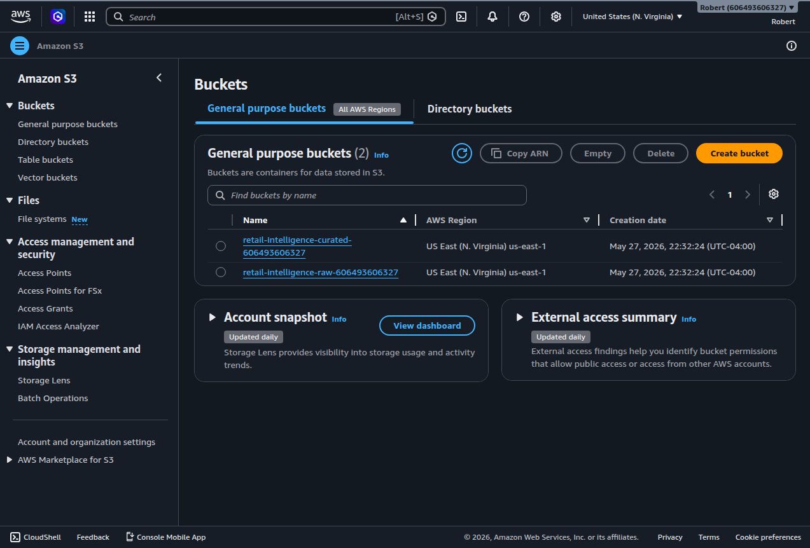

### 2. Batch transformation (Glue PySpark)

`glue_jobs/clean_retail_data.py` is the Glue entrypoint. The actual transformation logic lives in `glue_jobs/transformations.py` as plain PySpark functions that take a DataFrame in and return one out. This separation is what allows the transformations to be unit tested without a Glue cluster (more on testing below).

The job performs:

- Removes rows with null `Customer ID` (un-attributable transactions)
- Filters out cancelled invoices (invoice numbers beginning with `C`)
- Filters out non-positive quantity and price (returns, data errors)
- Derives a `Revenue` column (`Quantity * UnitPrice`)
- Parses `InvoiceDate` to a timestamp and extracts `year` / `month`
- Writes Snappy-compressed Parquet partitioned by `year` and `month`

Partitioning by date matches the dominant query pattern (time-range analytics) without over-partitioning. Querying a single month touches one folder. Partitioning on something high-cardinality like `CustomerID` would create millions of tiny files and degrade performance (the classic small-files problem); year/month keeps partition counts and file sizes healthy. The output looks like this in S3:

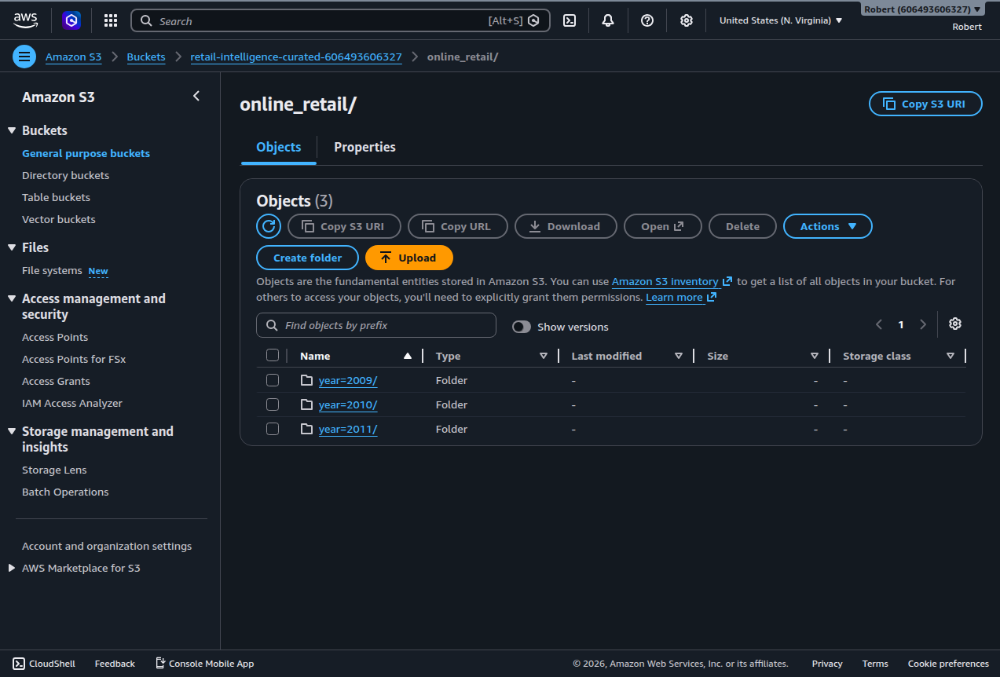

**Incremental processing via Glue job bookmarks.** The job uses `glue_context.create_dynamic_frame.from_options` with a `transformation_ctx`, which activates bookmarks. After the first full load, subsequent runs read only files added to `raw/online_retail/` since the last successful run. A run with no new files exits in under a minute with a "Nothing to process" log line, instead of reprocessing the full ~1M rows:

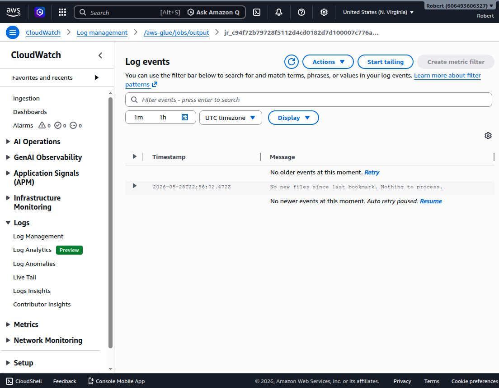

That single line of CloudWatch output is the entire payoff of bookmarks: a rerun is O(new data), not O(total data). Combined with `mode("append")` on the write path, reruns add new partitions rather than clobbering existing ones.

**Schema-evolution tolerance.** A declarative `CURATED_OPTIONAL_COLUMNS` dictionary in `transformations.py` lists fields that may or may not be present in incoming files. If a column is missing in a batch, the job backfills it as `NULL` so the curated table stays consistent. Adding a new optional column in the future is a one-line change to that dictionary.

When the original 1.07M-row file is followed by a smaller file with a new `loyalty_tier` column, both schemas land in the same curated table. Athena queries them side by side without any schema reconciliation work:

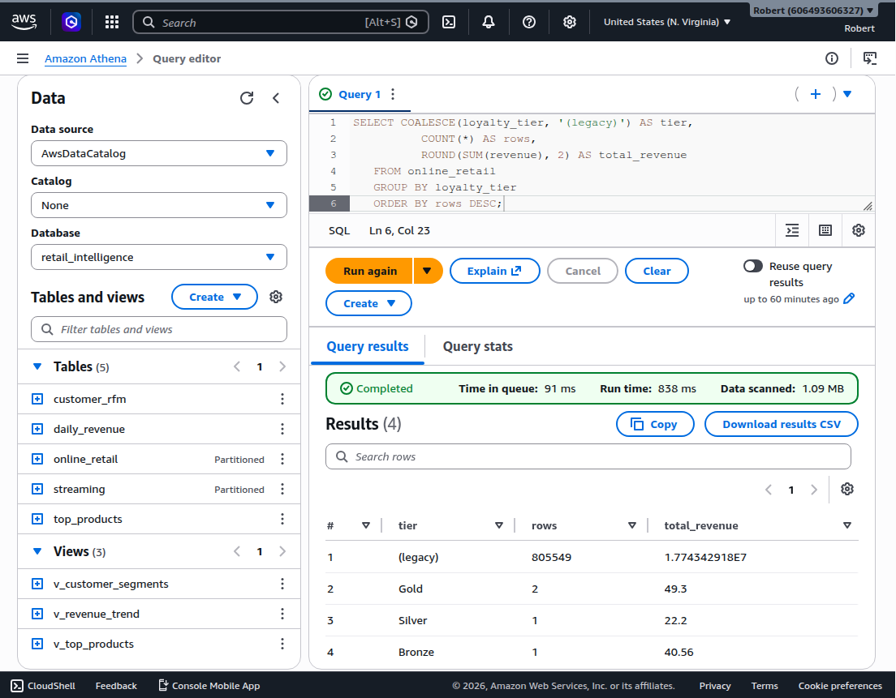

The "(legacy)" row is the 805,549 cleaned rows from the original Excel load with `loyalty_tier = NULL` (backfilled). The Gold, Silver, and Bronze rows are from the new schema. One table, two schema generations, zero downstream breakage.

### 3. Orchestration with quality gating (Step Functions)

`step_functions/pipeline_definition.json` defines a state machine that runs five steps in order:

`RunGlueETL -> RunQualityChecks -> RunCuratedCrawler -> BuildWarehouse -> RunWarehouseCrawler -> PipelineSucceeded`

Every step has a `Catch` clause routing failures to a `NotifyFailure` SNS publish, then to a terminal `PipelineFailed` state. This means **any failure anywhere in the pipeline produces a real-time email alert** before the workflow ends. The orchestration is end-to-end automated: nothing about the lake or the warehouse is updated by hand.

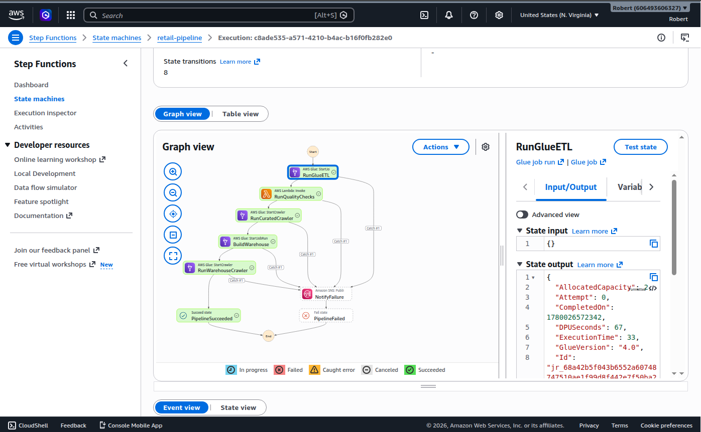

The data quality Lambda (`lambdas/quality_checks/handler.py`) runs four assertions against Athena inside a single invocation:

- **Row count** above a minimum threshold (catches catastrophic data loss)
- **Critical-field null rate** at zero for `invoice`, `customerid`, `revenue` (catches silent schema drift)
- **Revenue sanity** total above a minimum (catches an empty or corrupted load)
- **Partition presence** all expected year partitions exist (catches missing data)

The Lambda raises `QualityCheckFailed` on any failure. Step Functions catches the exception, publishes to SNS, then routes to `PipelineFailed`. The crawler step never runs on bad data. This is the difference between "fail-fast on data quality" and "warn and continue", which is how silently corrupted dashboards happen.

### 4. Event-driven ingestion (S3 -> Lambda -> DLQ)

A JSON order file dropped into `raw/incoming/` triggers an S3 ObjectCreated event, which invokes the Lambda function `retail-intelligence-event-ingestion`. The handler in `lambdas/event_ingestion/handler.py`:

- Validates each newline-delimited JSON event against a required schema (`invoice`, `stockcode`, `quantity`, `price`, `customerid`)
- Skips malformed JSON or individual invalid records (logged as warnings) so a single poison record does not sink the whole file
- Writes valid events to `raw/streaming/year=YYYY/month=M/<source-name>.json`
- Raises `ValidationError` if a file has zero valid events, sending the whole invocation to the SQS DLQ after two async retries

The Lambda configuration is a clean event-driven wiring: S3 on the left as the trigger, SQS on the right as the failure destination:

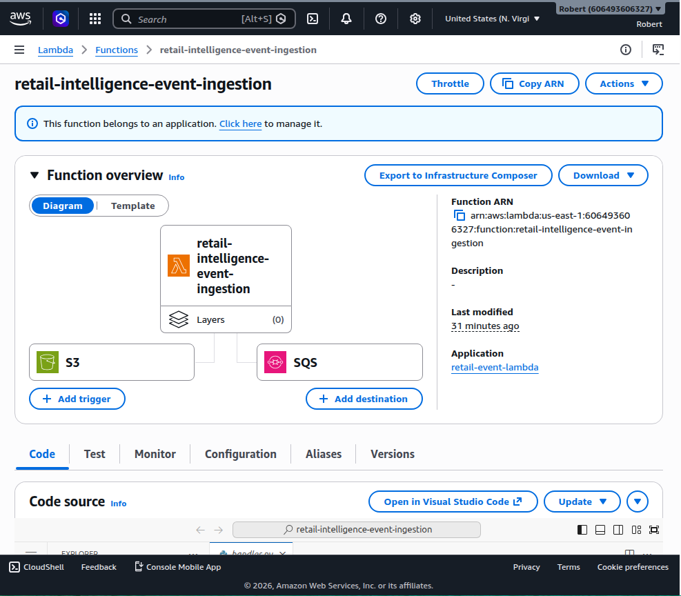

CloudWatch logs capture all three behaviors against real test traffic. Top section: the happy path (3 valid events written). Middle: skip warnings on a mixed file (one negative quantity, one missing field) followed by "Wrote 2 valid events". Bottom: the unrecoverable case with the `ValidationError` traceback:

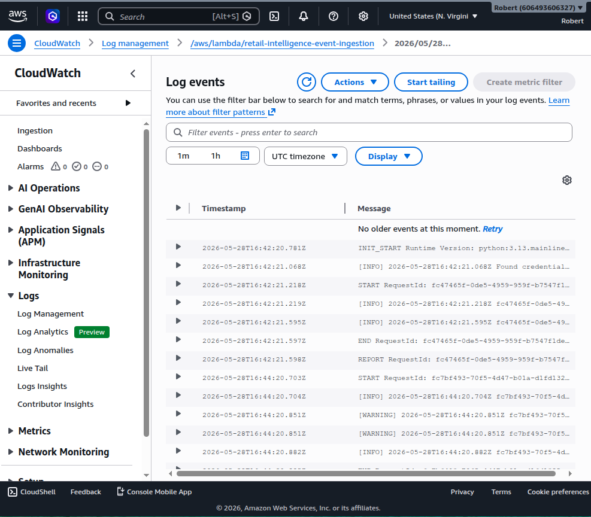

When the unrecoverable failure exhausts its two retries, the original S3 event payload lands in the DLQ for investigation. The DLQ has 14-day retention because a queue you can't inspect days later is useless:

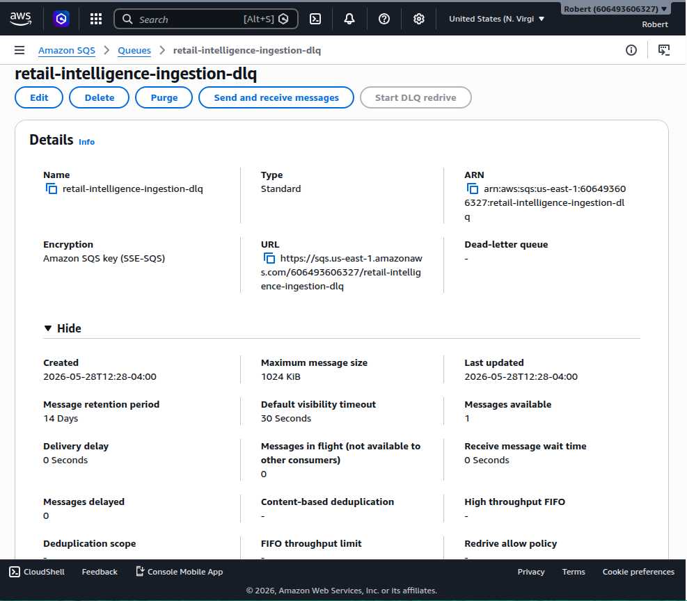

The dead-letter message preserves the original event payload, `condition: RetriesExhausted`, and `approximateInvokeCount: 3`. A CloudWatch alarm on `ApproximateNumberOfMessagesVisible > 0` publishes to the same SNS topic that the orchestration uses, so DLQ arrivals also send an email.

### 5. Cataloging (Glue Crawlers)

Three crawlers populate the `retail_intelligence` Glue database:

- `retail-curated-crawler` registers the batch Parquet as `online_retail` (partitioned by year/month)
- `retail-streaming-crawler` registers the event-driven JSON as `streaming` (partitioned by ingest date)
- `retail-warehouse-crawler` registers `daily_revenue`, `customer_rfm`, and `top_products`

The schema for the curated table shows the 11 columns plus two partition keys (`year` and `month`) Glue inferred from the folder structure:

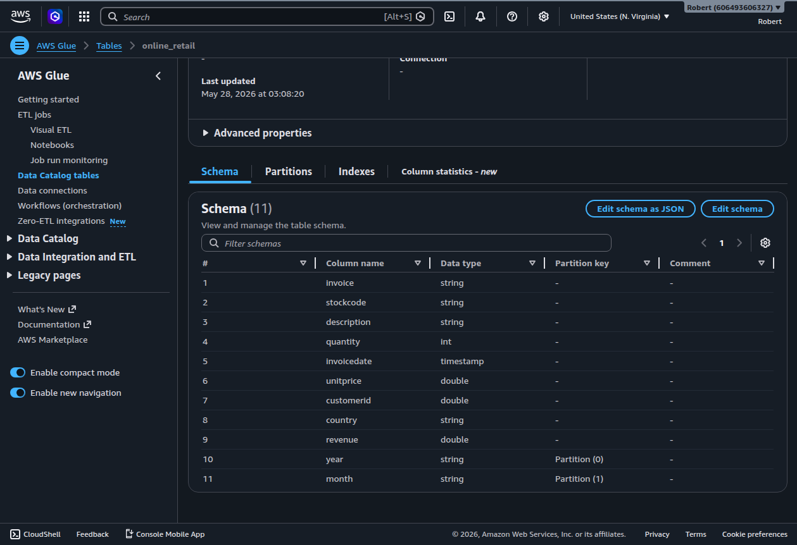

After both batch and streaming paths have run, the catalog has the unified picture of the lake (and after the warehouse build, the five tables and three views together):

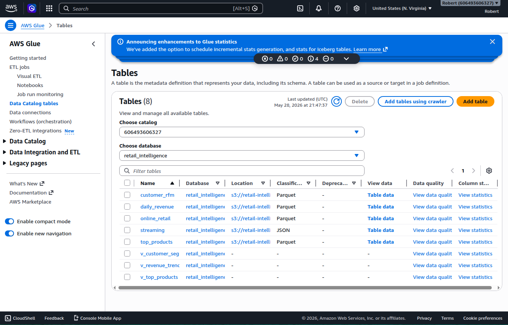

### 6. Warehouse layer (aggregations + views)

`glue_jobs/build_warehouse.py` reads the curated Parquet and writes three aggregation tables under `warehouse/`:

- **`daily_revenue`**: per-day revenue, order count, distinct customers, and unit count (time-series facts)
- **`customer_rfm`**: per-customer recency / frequency / monetary scores (segmentation inputs)
- **`top_products`**: per-product total revenue, unit count, and order count (performance ranking)

A BI dashboard would not aggregate 1.07M rows on every page load. Precomputing these tables means the view layer is fast and the curated zone is hit only when the underlying data changes.

Three Athena views (`queries/athena/02_warehouse_views.sql`) sit on top as the warehouse's query surface:

- `v_revenue_trend` aggregates `daily_revenue` into a monthly rollup
- `v_customer_segments` applies NTILE quartile scoring and CASE-driven labeling to bucket customers into Champions, Loyal, At Risk, Lost, New Customers, and Other
- `v_top_products` returns the top 50 products with a revenue rank

Views are the named, stable SQL surface analysts and BI tools hit, not the raw tables. They let the underlying physical model evolve without breaking consumers, and they encode the segmentation logic once instead of per-query.

### 7. Analytics (Athena)

All Athena queries run through a workgroup with a per-query data scan limit of 1 GB, so a runaway query cannot generate unexpected cost. The workgroup also sets the result location, enables CloudWatch metrics, and enforces its own configuration regardless of client overrides.

The monthly revenue query against the partitioned curated table scans 1.70 MB versus the ~95 MB raw CSV that a naive scan would read:

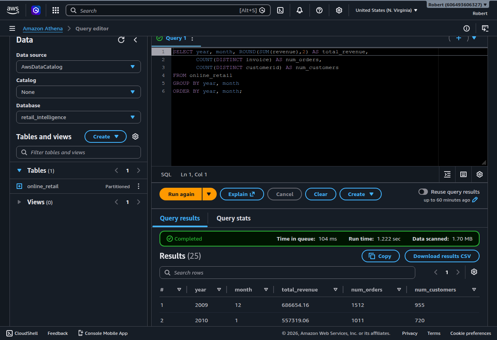

The customer-segment query, served through the `v_customer_segments` warehouse view, scans only 44.91 KB:

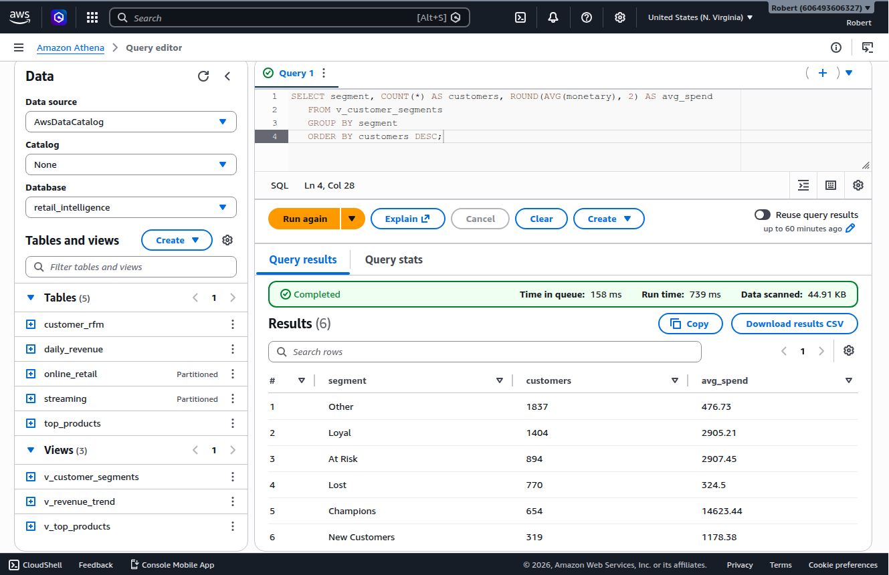

That 44.91 KB number is the combined payoff of columnar Parquet, Snappy compression, date partitioning, and the pre-aggregated warehouse layer. In Athena, which bills per terabyte scanned, less data scanned translates directly into lower query cost.

---

## Results

The pipeline produces real, defensible business insight on real data.

**Monthly revenue trend.** Clear seasonal pattern: revenue climbs toward Q4 each year, peaking in October and November above £1M per month (roughly $1.34M at current exchange rates), then drops sharply after the December cutoff in the data.

**Customer segmentation (via `v_customer_segments`):**

| Segment | Customers | Avg spend (£) |
|---|---:|---:|
| Champions | 653 | 14,623.44 |
| Loyal | 1,382 | 2,905.21 |
| At Risk | 892 | 2,907.45 |
| New Customers | 318 | 1,178.38 |
| Other | 1,850 | 476.73 |
| Lost | 783 | 324.50 |

This is actionable analytics: Champions and Loyal are the retention focus, At Risk is the same-value-as-Loyal-but-slipping win-back target, and Lost is deprioritized. The full pipeline turns 1.07M raw transactions into this six-row, decision-ready table.

> Currency note: the source retailer is UK-based, so revenue is in pounds sterling (GBP). USD figures use an approximate rate of £1 = $1.34 and will drift with the market.

---

## Why This Project Matters

The pipeline solves the same problems real retail and e-commerce data platforms solve every day:

- **Reliable historical ingestion** of large transactional datasets, with cleaning rules that reflect actual operational noise.
- **Event-driven near-real-time arrival** of new orders into the same lake, with failure handling and observability needed to run unattended.
- **A governed warehouse layer** that turns raw events into the metrics business users actually act on: revenue trends, customer segments, product rankings.
- **Automated quality gating** that prevents bad data from propagating to dashboards or analysts.
- **Operational alerting** so failures are seen, not silent.
- **Cost guardrails** so a misbehaving query or accumulating bucket cannot produce an unexpected bill.
- **Reproducibility** so the entire stack can be torn down and rebuilt from source on demand, with screenshots as the audit trail.

The substantive outcome: 1.07 million raw transactions become a small set of decision-ready aggregations a marketing team, buyer, or executive could act on immediately. The architecture would scale by swapping pieces (Kinesis for the S3 event source, Redshift or Snowflake for the Athena warehouse layer) without changing the data flow.

---

## Tests

Three test files run on every push via GitHub Actions, alongside `ruff` lint and `black` format checks. Mocked AWS keeps everything offline and fast.

**`tests/test_event_ingestion.py`** (7 cases, `moto`-mocked S3):

- Happy path writes all valid events
- Missing required field is skipped, valid records still processed
- Negative quantity is rejected
- Malformed JSON line is skipped
- Zero valid events raises `ValidationError` (the DLQ path)
- Idempotent output key on duplicate S3 events
- URL-encoded S3 keys are decoded

**`tests/test_quality_checks.py`** (4 cases, mocked Athena client):

- All metrics within thresholds returns `PASSED`
- Row count below threshold raises `QualityCheckFailed`
- Missing year partition raises `QualityCheckFailed`
- Non-zero null on a critical column raises `QualityCheckFailed`

**`tests/test_glue_transformations.py`** (8 cases, local-mode PySpark):

- Cleaning filters cancelled, null-customer, negative-qty, and zero-price rows
- Cleaning derives Revenue, year, and month correctly
- Optional `loyalty_tier` is backfilled as NULL when absent
- Optional `loyalty_tier` carries through when present
- Column renames (`Customer ID` -> `CustomerID`, `Price` -> `UnitPrice`)
- Daily revenue aggregation totals correctly
- Customer RFM computes recency, frequency, monetary
- Top products is sorted by revenue descending

Splitting Glue transformations into a separate `transformations.py` module is what makes the third file possible at all. Glue entry scripts call `getResolvedOptions` and `GlueContext` at module level, which fails outside a real Glue runtime. The pure-function module imports cleanly into local-mode PySpark and gets the same code paths under test that production runs.

19 tests in total, all passing in roughly 5 seconds on CI.

CI workflow (`.github/workflows/ci.yml`) installs Java 17 (PySpark's required JDK), Python 3.12, the project requirements, and PySpark 3.5.0, then runs lint, format, and the full test suite. The Java setup is the one non-obvious step: PySpark refuses to run under Java 21+ as of Spark 3.5, so the workflow explicitly pins the JDK.

---

## Reproducing This Pipeline

With the AWS CLI configured and Online Retail II Excel at `data/raw/online_retail_II.xlsx`:

```bash
# 1. Deploy infrastructure: buckets, IAM roles, DLQ, Lambdas, workgroup, alerting
aws cloudformation deploy --template-file infrastructure/cloudformation/01-s3-buckets.yaml \
  --stack-name retail-s3-buckets --parameter-overrides ProjectName=retail-intelligence
aws cloudformation deploy --template-file infrastructure/cloudformation/02-glue-role.yaml \
  --stack-name retail-glue-role --parameter-overrides ProjectName=retail-intelligence \
  --capabilities CAPABILITY_NAMED_IAM
aws cloudformation deploy --template-file infrastructure/cloudformation/03-stepfunctions-role.yaml \
  --stack-name retail-stepfunctions-role --parameter-overrides ProjectName=retail-intelligence \
  --capabilities CAPABILITY_NAMED_IAM
aws cloudformation deploy --template-file infrastructure/cloudformation/04-event-ingestion-role.yaml \
  --stack-name retail-ingestion-role --parameter-overrides ProjectName=retail-intelligence \
  --capabilities CAPABILITY_NAMED_IAM
aws cloudformation deploy --template-file infrastructure/cloudformation/06-quality-lambda-role.yaml \
  --stack-name retail-quality-lambda-role --parameter-overrides ProjectName=retail-intelligence \
  --capabilities CAPABILITY_NAMED_IAM
aws cloudformation deploy --template-file infrastructure/cloudformation/07-athena-workgroup.yaml \
  --stack-name retail-athena-workgroup --parameter-overrides ProjectName=retail-intelligence
aws cloudformation deploy --template-file infrastructure/cloudformation/08-alerting.yaml \
  --stack-name retail-alerting --parameter-overrides ProjectName=retail-intelligence AlertEmail=<YOUR_EMAIL>

# 2. Apply S3 lifecycle rules
aws s3api put-bucket-lifecycle-configuration --bucket retail-intelligence-curated-<ACCOUNT_ID> \
  --lifecycle-configuration file://infrastructure/s3-lifecycle-curated.json
aws s3api put-bucket-lifecycle-configuration --bucket retail-intelligence-raw-<ACCOUNT_ID> \
  --lifecycle-configuration file://infrastructure/s3-lifecycle-raw.json

# 3. Package and deploy both Lambdas
cd lambdas/event_ingestion && zip handler.zip handler.py && cd ../..
aws s3 cp lambdas/event_ingestion/handler.zip \
  s3://retail-intelligence-curated-<ACCOUNT_ID>/lambda/event_ingestion/handler.zip
aws cloudformation deploy --template-file infrastructure/cloudformation/05-event-lambda.yaml \
  --stack-name retail-event-lambda \
  --parameter-overrides ProjectName=retail-intelligence \
    CodeBucket=retail-intelligence-curated-<ACCOUNT_ID> \
  --capabilities CAPABILITY_NAMED_IAM
# (quality-checks Lambda created via aws lambda create-function, see scripts/)

# 4. Wire the S3 -> Lambda notification
aws s3api put-bucket-notification-configuration \
  --bucket retail-intelligence-raw-<ACCOUNT_ID> \
  --notification-configuration file://infrastructure/s3-notification.json

# 5. Ingest the historical dataset
python ingestion/batch/upload_raw_to_s3.py

# 6. Upload Glue scripts (including the shared transformations module)
aws s3 cp glue_jobs/clean_retail_data.py s3://retail-intelligence-curated-<ACCOUNT_ID>/scripts/
aws s3 cp glue_jobs/build_warehouse.py   s3://retail-intelligence-curated-<ACCOUNT_ID>/scripts/
aws s3 cp glue_jobs/transformations.py   s3://retail-intelligence-curated-<ACCOUNT_ID>/scripts/

# 7. Create Glue resources
bash scripts/setup_glue_resources.sh

# 8. Run the full orchestrated pipeline
aws stepfunctions start-execution \
  --state-machine-arn arn:aws:states:us-east-1:<ACCOUNT_ID>:stateMachine:retail-pipeline
```

> **Note on infrastructure lifecycle:** This project is designed to be stood up on demand, validated, captured, and torn down rather than left running. Glue, crawlers, Lambdas, and Athena are billed per use, so running the pipeline costs only cents per execution. Screenshots are the proof of successful runs; the infrastructure is fully reproducible from the CloudFormation templates above. S3 lifecycle rules expire Athena query results after 7 days and non-current object versions after 30 days to keep storage from creeping during long idle periods.

---

## Design Decisions and Lessons Learned

**Multi-zone data lake with immutable raw.** Raw data is never mutated. Every transformation writes a new derived artifact in curated or warehouse, so any processing bug can be fixed and re-run from immutable source without data loss. This is the most boring decision in the project and also the most important one.

**Parquet over CSV in the curated zone.** Columnar Parquet with Snappy compression enables predicate pushdown and column pruning, so Athena reads only the columns and partitions a query touches. The 1.70 MB curated scan and 44.91 KB warehouse-view scan are this decision made measurable.

**Partition by year/month, not finer.** Date partitioning matches the dominant query pattern (time-range analytics) without over-partitioning. Month granularity keeps partition counts and file sizes healthy. Partitioning on something high-cardinality would create millions of tiny files and degrade performance.

**Incremental processing via bookmarks, not full reloads.** Reruns are O(new data), not O(total data). A rerun with no new files exits in under a minute. The job uses `glue_context.create_dynamic_frame.from_options` with a `transformation_ctx`, which is the API that actually drives bookmarks; plain `spark.read.csv` does not.

**Append, not overwrite, on bookmarked writes.** With bookmarks, each run writes a new partition slice, so the curated table uses `mode("append")`. Combined with idempotent partition keys (`year`, `month`), reruns add to the lake instead of clobbering it.

**Schema evolution as a one-line change.** A declarative `CURATED_OPTIONAL_COLUMNS` dictionary lists optional fields. The job backfills missing columns as `NULL` so old and new schemas coexist in the same table. New optional fields can be added without breaking existing partitions or downstream queries.

**Step Functions instead of chained Lambda or cron.** A state machine gives a visual execution history, native synchronous waiting on the Glue job (`.sync`), and declarative error handling via `Catch`. The full pipeline (ETL, quality, curated catalog, warehouse build, warehouse catalog) runs as one auditable, re-runnable workflow.

**Fail-fast data quality, not best-effort.** Quality checks run inside the orchestrated pipeline, and a failure raises an exception that Step Functions catches and routes to `NotifyFailure` -> `PipelineFailed`. The downstream crawler never runs if quality is bad. The alternative ("warn and continue") is how silently corrupted dashboards happen.

**Event-driven Lambda with DLQ instead of polling.** The Lambda consumer fires on S3 ObjectCreated events automatically. Two async retry attempts plus an SQS dead-letter destination means nothing is silently dropped; failed files are retried with backoff, and what still fails lands in a 14-day queue with the original event payload preserved.

**Validate-skip vs validate-fail at two levels.** Inside a file, a single malformed record is skipped (one bad line should not sink a whole file). At the file level, a file with zero valid records raises so the async path routes to the DLQ. This mirrors how real consumers distinguish recoverable from unrecoverable failures.

**Idempotent output keys.** The Lambda derives the output key deterministically from the source filename, so a duplicate S3 event (S3 delivers at-least-once) overwrites rather than duplicates. The same property a Kinesis or Kafka consumer must design for.

**Pre-aggregated warehouse instead of always re-aggregating.** Daily revenue, customer RFM, and product rankings are precomputed by the warehouse Glue job. The view layer scans 44.91 KB, not 95 MB.

**Athena views as the warehouse query surface.** Views are the named, stable SQL surface analysts hit. The segmentation logic (NTILE quartiles, segment labels) is encoded once in `v_customer_segments` instead of per-query.

**Pure functions for transformation logic so they are testable.** Glue entry scripts call `getResolvedOptions` and `GlueContext` at module level, which fails outside a real Glue runtime. Pulling the transformations into `glue_jobs/transformations.py` as plain PySpark functions lets them be imported and tested in local-mode PySpark. CI exercises the same code paths Glue runs in production.

**Operational alerting on the two real failure modes.** Step Functions publishes to SNS in the Catch path before failing, so a stage failure triggers an email. A CloudWatch alarm on the ingestion DLQ depth publishes to the same SNS topic, so a poison file arrival also triggers an email. Two real failure modes, one alerting channel, both wired up.

**Cost guardrails on the two things that can creep.** An Athena workgroup caps each query at 1 GB scanned, so a runaway query cannot generate an unexpected bill. S3 lifecycle rules expire Athena results after 7 days and non-current object versions after 30 days, so storage cannot grow forever on bucket versioning + result accumulation.

**Separate IAM roles per service, least privilege.** The Glue role can read raw and write curated. The Step Functions role can start Glue resources, invoke the quality Lambda, and publish to the alerts topic. The event-ingestion Lambda role can read `incoming/*`, write `streaming/*`, and send to its DLQ. The quality Lambda role can query Athena and read curated. Scoping limits blast radius if a credential is ever compromised.

**CI from commit one.** GitHub Actions runs ruff, black, and pytest on every push. Three test suites totaling 19 tests catch behavior regressions on both Lambdas and the PySpark transformations.

---

## Tech Stack

| Layer | Tools |
|---|---|
| **Languages** | Python 3.13 (Lambda) and 3.12 (local), PySpark, SQL (Athena/Presto dialect), Bash |
| **AWS data services** | S3, Glue (Spark 4.0), Glue Data Catalog, Athena (workgroup), Step Functions, Lambda, SQS, SNS, CloudWatch |
| **AWS platform** | CloudFormation, IAM |
| **Data formats** | Parquet (Snappy compression), newline-delimited JSON, CSV |
| **Python libraries** | boto3, pandas, openpyxl, pyarrow, pyspark==3.5.0, moto, pytest, python-dotenv, pyyaml |
| **Tooling** | ruff, black, pytest, GitHub Actions, AWS CLI v2, JDK 17 (for PySpark) |
| **Design patterns** | Multi-zone data lake, immutable raw + forward derivation, partitioned columnar storage, incremental processing via bookmarks, schema-evolution tolerance, orchestrated ETL with Catch states, event-driven consumer with DLQ, fail-fast data quality gating, pre-aggregated warehouse, view-based query surface, least-privilege IAM, idempotent writes, operational alerting via SNS, mocked-AWS unit testing |

---

## Honest Limitations

The project is genuinely production-shaped, but it is not production scale. A few specific limits worth naming so anyone reviewing knows what to ask about:

- **Volume.** 1.07M rows is a sample size. The same patterns scale to billions on Glue, but this project does not test that boundary. Real shuffle tuning, partition-pruning measurement, and EMR-vs-Glue tradeoffs are not exercised here.
- **CDC and late data.** All ingestion is either full-batch (Online Retail II) or replay-style event drops into `raw/incoming/`. There is no change-data-capture from a source database, no slowly-changing-dimension (SCD2) modeling, and no explicit late-arriving-data handling on the warehouse aggregations.
- **Multiple sources.** One dataset, one shape. Real platforms reconcile schemas across many upstream systems.
- **Streaming.** The "event-driven" path is S3 events, not true streaming. The free-plan constraint blocks Kinesis. The substantive consumer behavior (validation, DLQ, idempotency, retries) transfers, but real shard management, retention windows, and consumer lag are not exercised.
- **Warehouse engine.** Athena views serve the warehouse role here, not Redshift. Same constraint, same transferable modeling.

These are the next things I would build on a follow-up project rather than try to retrofit here.

---

## Roadmap

- **Kinesis Data Streams + Firehose** when the AWS account is upgraded off the free plan, replacing the S3-event ingestion with stream-based ingestion that exercises shard management and retention.
- **CDC from a source database** (RDS Postgres + DynamoDB Streams or Debezium) with SCD2 modeling in the curated zone, to demonstrate change-data ingestion that the current full-batch path does not.
- **Redshift Serverless** as the warehouse layer, with the Parquet aggregations loaded via `COPY` and the views recreated as materialized views.
- **QuickSight dashboard** over the Athena views for an end-user-facing analytics surface.
- **End-to-end integration tests** that deploy the full stack, run the pipeline, and tear it down in CI.
