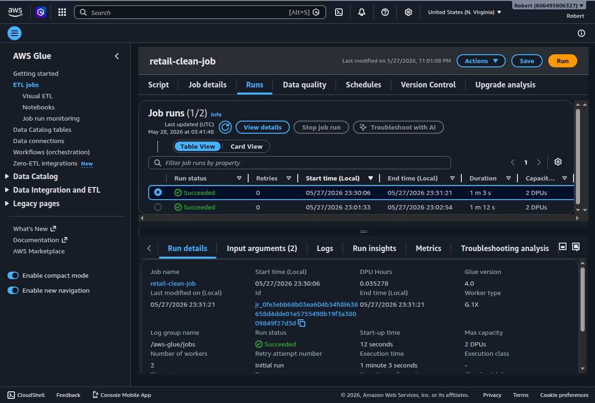
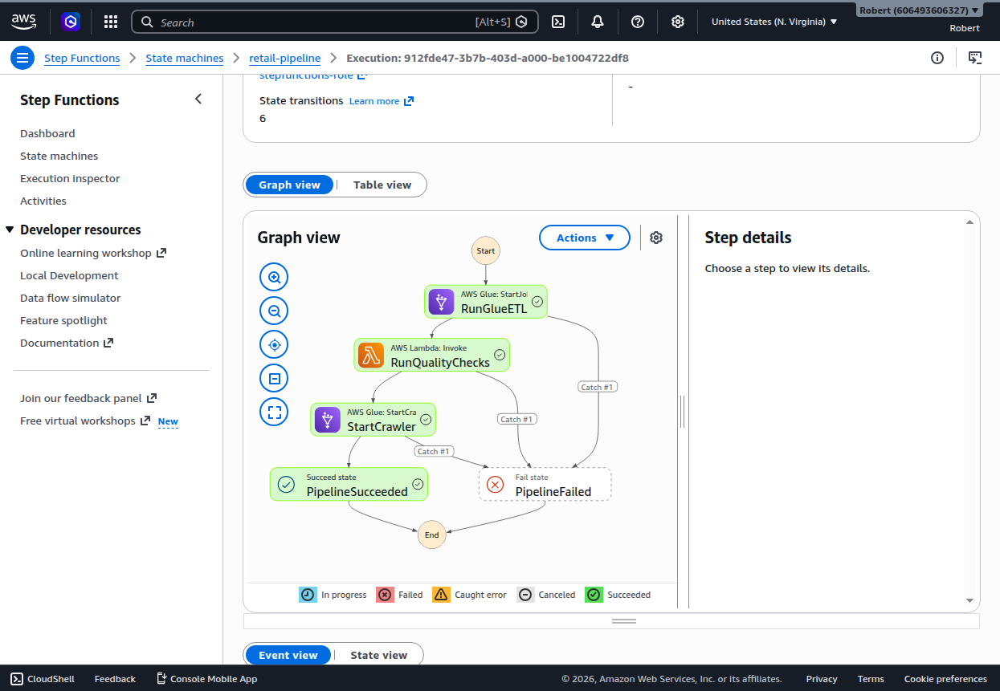

# Retail Intelligence AWS Data Pipeline

An end-to-end, infrastructure-as-code data engineering pipeline on AWS. It ingests retail transaction data through two paths (historical batch and event-driven), transforms it through a partitioned data lake, builds a warehouse layer of pre-aggregated tables, and exposes everything as SQL through Athena views.

The dataset is the [UCI Online Retail II](https://archive.ics.uci.edu/dataset/502/online+retail+ii) set: about 1.07 million real e-commerce transactions across 2009-2011, complete with the nulls, cancellations, and negative quantities found in real operational data.

The project demonstrates the patterns a working data engineer ships: IaC for every resource, least-privilege IAM, partitioned columnar storage, orchestration with explicit error handling, event-driven serverless consumption with dead-letter queues, unit tests against mocked AWS, and a curated warehouse layer with reusable SQL views.

---

## Architecture

```
                           Historical batch                        Event-driven (live)
                                  |                                         |
                                  v                                         v
                       Python batch ingestion                 New JSON file -> raw/incoming/
                                  |                                         |
                                  v                                         |
                       S3 Raw Zone (CSV)                                    |
                                  |                                         v
                                  v                          S3 ObjectCreated event -> Lambda
                  Step Functions orchestration                              |
                                  |                  +-----------------------+-----------------+
                                  |                  v                                         v
                                  |          Validate & write                     Failures -> SQS DLQ
                                  v                  |                            (after retries)
                       AWS Glue PySpark ETL          v
                                  |          raw/streaming/  (event JSON,
                                  v          partitioned by year/month)
                  S3 Curated Zone (Parquet,
                  partitioned by year/month)
                                  |
                                  v
                       Glue Crawlers -> Glue Data Catalog
                                  |
                                  v
                 AWS Glue PySpark warehouse build
                                  |
                                  v
                  S3 Warehouse Zone (Parquet
                  aggregations: daily_revenue,
                  customer_rfm, top_products)
                                  |
                                  v
                  Athena Views (the warehouse
                  query surface for BI/analysts)
                                  |
                                  v
                       Athena SQL analytics
```

Every AWS resource is defined in CloudFormation and deployed from the CLI. The Lambda consumer is tested with `moto` so AWS is mocked in CI.

---

## A Note on AWS Free Plan Constraints

This project is built end-to-end on the new AWS free plan, which deliberately restricts certain services until an account is upgraded. Two architectural choices reflect that constraint, and I want them stated up front rather than dressed up:

**Event-driven ingestion instead of Kinesis.** The original design used Kinesis Data Streams to demonstrate streaming ingestion. The free plan returns `SubscriptionRequiredException` for Kinesis and Firehose, so the streaming layer was rebuilt around **S3 Event Notifications -> Lambda -> SQS DLQ**. This is a real, widely used event-driven pattern, not a workaround. The consumer pattern (validate, write raw, route failures to a DLQ, idempotent output keys, async retries) transfers directly to a Kinesis or Kafka consumer, which is the substantive skill being demonstrated.

**Athena views + pre-aggregated Parquet instead of Redshift.** The original design loaded curated data into Redshift Serverless. Redshift is also blocked on the free plan. The warehouse layer is instead built as pre-aggregated Parquet tables under a `warehouse/` prefix, cataloged by a crawler, and exposed through three named Athena views (the same query surface a BI tool would hit on a Redshift warehouse). This is the "lakehouse" pattern many real shops prefer for cost reasons, and the modeling, partitioning, and view layer transfer one-to-one to Redshift if needed.

These pivots are honest engineering responses to a real constraint, and both result in patterns used in production at companies that deliberately stay on S3 + Athena.

---

## AWS Services Used

| Service | Role in the pipeline |
|---|---|
| **S3** | Multi-zone data lake: raw (incoming + landing), streaming (event-driven raw), curated (Parquet), warehouse (aggregations), athena-results, scripts |
| **AWS Glue (PySpark)** | Two ETL jobs (clean batch data, build warehouse aggregations) with **bookmarks enabled** so reruns only process new files |
| **Glue Crawlers + Data Catalog** | Schema inference and table registration across curated, streaming, and warehouse zones |
| **Step Functions** | Orchestrates the batch ETL, a quality-check Lambda, and the crawler, with explicit error handling via Catch states. **Quality failures block the crawler step** (fail-fast on bad data) |
| **AWS Lambda (Python 3.13)** | Two functions: an event-driven ingestion consumer triggered by S3, and a synchronous data quality Lambda invoked by Step Functions |
| **SQS** | Dead-letter queue for unrecoverable Lambda failures, with 14-day retention |
| **Amazon Athena** | Serverless SQL over Parquet, plus three reusable views as the warehouse query surface |
| **CloudFormation** | Infrastructure as code for every bucket, role, queue, Lambda, and orchestration resource |
| **IAM** | Least-privilege service roles for Glue, Step Functions, and both Lambdas |

---

## Repository Structure

```
retail-intelligence-aws/
├── infrastructure/
│   └── cloudformation/
│       ├── 01-s3-buckets.yaml              # Raw + curated data lake buckets
│       ├── 02-glue-role.yaml               # Glue service IAM role
│       ├── 03-stepfunctions-role.yaml      # Step Functions role (Glue + Lambda invoke)
│       ├── 04-event-ingestion-role.yaml    # Event-ingestion Lambda role + SQS DLQ
│       ├── 05-event-lambda.yaml            # Event-ingestion Lambda + async failure destination
│       └── 06-quality-lambda-role.yaml     # Quality-checks Lambda IAM role
├── ingestion/
│   └── batch/
│       └── upload_raw_to_s3.py             # Combine Excel sheets, push to raw zone
├── glue_jobs/
│   ├── clean_retail_data.py                # Bookmark-aware, schema-evolution-tolerant batch ETL
│   └── build_warehouse.py                  # PySpark warehouse build: daily revenue, RFM, top products
├── lambdas/
│   ├── event_ingestion/
│   │   └── handler.py                      # Event-driven consumer: validate, write raw, fail to DLQ
│   └── quality_checks/
│       └── handler.py                      # Data quality assertions (Athena-backed)
├── step_functions/
│   └── pipeline_definition.json            # State machine: ETL -> quality -> crawler, Catch on each
├── queries/
│   └── athena/
│       ├── 01_monthly_revenue.sql          # Example analytics query
│       └── 02_warehouse_views.sql          # Three warehouse views
├── tests/
│   ├── test_event_ingestion.py             # moto-mocked Lambda unit tests (7 cases)
│   └── test_quality_checks.py              # mocked-Athena unit tests (4 cases)
├── scripts/
│   └── setup_glue_resources.sh             # Reproducibly create Glue DB, job, crawler
├── screenshots/                            # Console proof of execution
├── .github/workflows/ci.yml                # ruff + black + pytest on every push
├── pyproject.toml
└── requirements.txt
```

---

## Pipeline Walkthrough

### 1. Batch ingestion (raw zone)

`ingestion/batch/upload_raw_to_s3.py` reads both sheets of the Online Retail II Excel file, concatenates them into a single ~1.07M-row frame, writes a combined CSV, and uploads it to the raw S3 zone. The raw zone keeps source data immutable, a core data-lake principle: never transform in place; always derive forward.

### 2. Batch transformation (Glue PySpark)

`glue_jobs/clean_retail_data.py` runs on serverless Spark (Glue 4.0, 2 x G.1X workers) and performs:

- Removes rows with null `Customer ID` (un-attributable transactions)
- Filters out cancelled invoices (invoice numbers beginning with `C`)
- Filters out non-positive quantity and price (returns, data errors)
- Derives a `Revenue` column (`Quantity * UnitPrice`)
- Parses `InvoiceDate` to a timestamp and extracts `year` / `month`
- Writes Snappy-compressed Parquet partitioned by `year` and `month`

Partitioning by date means queries that filter on a time range scan only the relevant partitions instead of the whole dataset, which is the core mechanism behind the efficiency gains shown below.

**Incremental processing via Glue job bookmarks.** The job uses Glue's `create_dynamic_frame.from_options` with a `transformation_ctx`, which activates bookmarks. After the first full load, subsequent runs read only files added to `raw/online_retail/` since the last successful run. A run with no new files exits with "Nothing to process" in under a minute, instead of reprocessing 1M rows.

**Schema-evolution tolerance.** A declarative `CURATED_OPTIONAL_COLUMNS` dictionary lists fields that may or may not be present in incoming files. If a column is missing in a batch, the job backfills it as `NULL` so the curated table stays consistent. Adding a new optional column to the schema in the future is a one-line change.

### 3. Orchestration (Step Functions)

`step_functions/pipeline_definition.json` defines a state machine that runs the Glue job synchronously, then invokes the data quality Lambda, then triggers the crawler. Every step has a `Catch` clause routing failures to a dedicated `PipelineFailed` state. This turns a sequence of manual CLI calls into a single auditable, re-runnable workflow with built-in error handling.

The workflow is **fail-fast on data quality**: if any quality assertion fails, the Lambda raises `QualityCheckFailed`, the Catch fires, and the crawler step never runs. Bad curated data never propagates downstream to the catalog or analysts.

The data quality Lambda (`lambdas/quality_checks/handler.py`) runs four assertions against Athena, in parallel within a single invocation:

- **Row count** above a minimum threshold (catches catastrophic data loss)
- **Critical-field null rate** under threshold for `invoice`, `customerid`, `revenue` (catches silent schema drift)
- **Revenue sanity** total above a minimum (catches an empty or corrupted load)
- **Partition presence** all expected year partitions exist (catches missing data)

Each check returns a structured result. On success, the function returns a JSON summary that Step Functions records in the execution history.

### 4. Event-driven ingestion (S3 -> Lambda -> DLQ)

A JSON order file dropped into `raw/incoming/` triggers an S3 ObjectCreated event, which invokes the Lambda function `retail-intelligence-event-ingestion`. The handler in `lambdas/event_ingestion/handler.py`:

- Validates each newline-delimited JSON event against a required schema (`invoice`, `stockcode`, `quantity`, `price`, `customerid`)
- Skips malformed JSON or invalid records (logged as warnings) so a single poison record does not sink the whole file
- Writes valid events to `raw/streaming/year=YYYY/month=M/<source-name>.json`
- Raises `ValidationError` if a file has zero valid events, sending the whole invocation to the SQS DLQ after two async retries

The DLQ message preserves the original S3 event payload plus `condition: RetriesExhausted` and `approximateInvokeCount: 3`, so an on-call engineer can replay the file or inspect why it failed.

### 5. Cataloging (Glue Crawlers)

Three crawlers populate the `retail_intelligence` Glue database:

- `retail-curated-crawler` registers the batch Parquet as `online_retail` (partitioned by year/month)
- `retail-streaming-crawler` registers the event-driven JSON as `streaming` (partitioned by ingest date)
- `retail-warehouse-crawler` registers `daily_revenue`, `customer_rfm`, and `top_products`

### 6. Warehouse layer (aggregations + views)

`glue_jobs/build_warehouse.py` reads the curated Parquet and writes three aggregation tables under `warehouse/`:

- **`daily_revenue`**: per-day revenue, order count, distinct customers, and unit count (time-series facts)
- **`customer_rfm`**: per-customer recency / frequency / monetary scores (segmentation inputs)
- **`top_products`**: per-product total revenue, unit count, and order count (performance ranking)

Three Athena views (`queries/athena/02_warehouse_views.sql`) sit on top as the warehouse's query surface:

- `v_revenue_trend` aggregates `daily_revenue` into a monthly rollup for trend dashboards
- `v_customer_segments` applies NTILE-based RFM scoring and CASE-driven labeling to bucket customers into Champions, Loyal, At Risk, Lost, New Customers, and Other
- `v_top_products` returns the top 50 products with a revenue rank

### 7. Analytics (Athena)

Athena queries the views directly, scanning only the small Parquet aggregations rather than the raw data. The customer-segment query (shown below) scans 44.91 KB.

---

## Results

The pipeline produces real, defensible business insight on real data.

**Monthly revenue trend.** Clear seasonal pattern: revenue climbs toward Q4 each year, peaking in October and November above £1M per month (roughly $1.34M at current exchange rates), then drops sharply after the December cutoff in the data.

**Customer segmentation (via `v_customer_segments`):**

| Segment | Customers | Avg spend (£) |
|---|---:|---:|
| Champions | 654 | 14,623.44 |
| Loyal | 1,404 | 2,905.21 |
| At Risk | 894 | 2,907.45 |
| New Customers | 319 | 1,178.38 |
| Other | 1,837 | 476.73 |
| Lost | 770 | 324.50 |

This is actionable analytics: Champions and Loyal are the retention focus, At Risk is the same-value-as-Loyal-but-slipping win-back target, and Lost is deprioritized. The full pipeline turns 1.07M raw transactions into this six-row, decision-ready table.

**Query efficiency.** The customer-segment query scans only 44.91 KB of pre-aggregated Parquet versus the ~95 MB raw CSV that a naive scan would read. This is the combined payoff of columnar Parquet, Snappy compression, partitioning, and the pre-aggregated warehouse layer. In Athena, which bills per terabyte scanned, less data scanned translates directly into lower query cost.

> Currency note: the source retailer is UK-based, so revenue is in pounds sterling (GBP). USD figures use an approximate rate of £1 = $1.34 and will drift with the market.

---

## Why This Project Matters

The pipeline solves the same set of problems real retail and e-commerce data platforms solve every day:

- **Reliable historical ingestion** of large transactional datasets, with cleaning rules that reflect actual operational noise (cancellations, negative quantities, missing customer IDs).
- **Event-driven near-real-time arrival** of new orders into the same lake, with the failure handling and observability needed to run unattended.
- **A governed warehouse layer** that turns raw events into the metrics business users actually care about: revenue trends, customer segments, product rankings.
- **Reproducibility** so the entire stack can be torn down and rebuilt from source on demand, with screenshots as the audit trail.

The substantive outcome: 1.07 million raw transactions become a small set of decision-ready aggregations that a marketing team, a buyer, or an executive could act on immediately. The architecture would scale by swapping a few pieces (Kinesis for the S3 event source; Redshift or Snowflake for the Athena warehouse layer) without changing the data flow.

---

## Proof of Execution

### Data lake (S3)

**Raw and curated buckets, both created from CloudFormation:**


**Curated zone partitioned by year and month after the Glue job ran:**


### Batch ETL (Glue)

**Glue PySpark job runs, both Succeeded, ~1 minute each on 2 DPUs:**



**Bookmark proof: a follow-up run with no new files exits cleanly without reprocessing the existing 1M+ rows:**


**Glue Data Catalog schema for the curated table, with `year` and `month` registered as partition keys:**


### Orchestration (Step Functions)

**State machine execution: RunGlueETL, then RunQualityChecks (Lambda), then StartCrawler, all green, with `PipelineFailed` defined as the Catch destination on every step:**



### Event-driven ingestion (Lambda + SQS)

**Lambda function with the S3 trigger on the left and the SQS DLQ destination on the right:**


**CloudWatch logs showing the three behaviors: happy path, poison-record skips, and the raised `ValidationError` that hit the DLQ:**


**SQS dead-letter queue holding the one message that failed after retries (14-day retention for investigation):**


### Analytics (Athena)

**Monthly revenue aggregation against the partitioned Parquet, only 1.70 MB scanned:**


**Glue catalog after the event-driven ingestion, with both batch (`online_retail`) and streaming tables registered:**


**Full catalog after the warehouse build: 5 tables (`customer_rfm`, `daily_revenue`, `online_retail`, `streaming`, `top_products`) plus 3 views (`v_customer_segments`, `v_revenue_trend`, `v_top_products`):**


**Customer-segment query through the `v_customer_segments` warehouse view, six segment buckets returned, only 44.91 KB scanned:**


**Schema-evolution proof: a follow-up file with a new `loyalty_tier` column lands in the same curated table. Athena queries old (legacy, NULL tier) and new (Gold/Silver/Bronze) rows together with no breakage:**


---

## Tests

Two test files run on every push via GitHub Actions, alongside `ruff` lint and `black` format checks. Both use mocked AWS so they run offline in well under a second.

**`tests/test_event_ingestion.py`** (7 cases, `moto`-mocked S3):

- Happy path: three valid events written
- Missing required field: skipped, valid records still processed
- Negative quantity: validation rejects it
- Malformed JSON line: skipped, continues processing
- Zero valid events in file: raises `ValidationError` (the path that hits the DLQ in production)
- Idempotency: reprocessing the same file overwrites rather than duplicates
- URL-encoded S3 keys: decoded correctly

**`tests/test_quality_checks.py`** (4 cases, mocked Athena client):

- All metrics within thresholds: handler returns `PASSED`
- Row count below threshold: raises `QualityCheckFailed`
- Missing year partition: raises `QualityCheckFailed`
- Non-zero nulls in a critical column: raises `QualityCheckFailed`

CI workflow: `.github/workflows/ci.yml`.

---

## Reproducing This Pipeline

With the AWS CLI configured and Online Retail II Excel at `data/raw/online_retail_II.xlsx`:

```bash
# 1. Deploy infrastructure (S3 buckets, IAM roles, DLQ, Lambda)
aws cloudformation deploy --template-file infrastructure/cloudformation/01-s3-buckets.yaml \
  --stack-name retail-s3-buckets --parameter-overrides ProjectName=retail-intelligence
aws cloudformation deploy --template-file infrastructure/cloudformation/02-glue-role.yaml \
  --stack-name retail-glue-role --parameter-overrides ProjectName=retail-intelligence \
  --capabilities CAPABILITY_NAMED_IAM
aws cloudformation deploy --template-file infrastructure/cloudformation/03-stepfunctions-role.yaml \
  --stack-name retail-stepfunctions-role --parameter-overrides ProjectName=retail-intelligence \
  --capabilities CAPABILITY_NAMED_IAM
aws cloudformation deploy --template-file infrastructure/cloudformation/04-event-ingestion-role.yaml \
  --stack-name retail-ingestion-role --parameter-overrides ProjectName=retail-intelligence \
  --capabilities CAPABILITY_NAMED_IAM

# 2. Package and deploy the Lambda
cd lambdas/event_ingestion && zip handler.zip handler.py && cd ../..
aws s3 cp lambdas/event_ingestion/handler.zip \
  s3://retail-intelligence-curated-<ACCOUNT_ID>/lambda/event_ingestion/handler.zip
aws cloudformation deploy --template-file infrastructure/cloudformation/05-event-lambda.yaml \
  --stack-name retail-event-lambda \
  --parameter-overrides ProjectName=retail-intelligence \
    CodeBucket=retail-intelligence-curated-<ACCOUNT_ID> \
  --capabilities CAPABILITY_NAMED_IAM

# 3. Wire the S3 -> Lambda notification
aws s3api put-bucket-notification-configuration \
  --bucket retail-intelligence-raw-<ACCOUNT_ID> \
  --notification-configuration file://infrastructure/s3-notification.json

# 4. Ingest the historical dataset to the raw zone
python ingestion/batch/upload_raw_to_s3.py

# 5. Create Glue resources, then run the batch pipeline
bash scripts/setup_glue_resources.sh
aws stepfunctions start-execution \
  --state-machine-arn arn:aws:states:us-east-1:<ACCOUNT_ID>:stateMachine:retail-pipeline

# 6. Build the warehouse layer
aws glue start-job-run --job-name retail-build-warehouse
aws glue start-crawler --name retail-warehouse-crawler

# 7. Create the Athena views (each CREATE VIEW from queries/athena/02_warehouse_views.sql
#    submitted via athena start-query-execution)
```

> **Note on infrastructure lifecycle:** This project is designed to be stood up on demand, validated, captured, and torn down rather than left running. Glue, crawlers, Lambda, and Athena are billed per use, so running the pipeline costs only cents per execution. The screenshots in this repo are the proof of successful runs; the infrastructure itself is fully reproducible from the CloudFormation templates and scripts above.

---

## Design Decisions and Lessons Learned

**Incremental processing via bookmarks, not full reloads.** The batch ETL uses Glue job bookmarks so reruns are O(new data) instead of O(total data). A rerun with no new files exits in under a minute. This is how real lakes handle continuous ingestion without burning compute on already-processed files.

**Append, not overwrite, on bookmarked writes.** With bookmarks enabled, each run writes a new partition slice, so the curated table uses `mode("append")`. Combined with idempotent partition keys (`year`, `month`), reruns add to the lake instead of clobbering it.

**Fail-fast data quality, not best-effort.** Data quality checks run inside the orchestrated pipeline, and a failure raises `QualityCheckFailed`, which Step Functions catches and routes to `PipelineFailed`. The downstream crawler never runs if quality is bad. The alternative ("warn and continue") is how silently corrupted dashboards happen.

**Schema evolution as a one-line change.** A declarative `CURATED_OPTIONAL_COLUMNS` dictionary lists optional fields. The job backfills missing columns as `NULL` so old and new schemas coexist in the same table. New optional fields can be added without breaking existing partitions or downstream queries.

**Parquet over CSV in the curated zone.** Columnar Parquet with Snappy compression enables predicate pushdown and column pruning, so Athena reads only the columns and partitions a query touches. The 1.70 MB curated scan and 44.91 KB warehouse-view scan are this decision made measurable.

**Partition by year/month, not finer.** Date partitioning matches the dominant query pattern (time-range analytics) without over-partitioning. Partitioning on something high-cardinality like `CustomerID` would create millions of tiny files and degrade performance, the classic small-files problem. Month granularity keeps partition counts and file sizes healthy.

**Step Functions instead of chained Lambda or cron.** A state machine gives a visual execution history, native synchronous waiting on the Glue job (`.sync`), and declarative error handling via `Catch`. The `PipelineFailed` state never fires on a healthy run, but its presence means the pipeline is built for failure, not just the happy path.

**Event-driven Lambda with DLQ instead of polling.** The Lambda consumer fires on S3 ObjectCreated events automatically. Two async retry attempts plus an SQS dead-letter destination means nothing is silently dropped; failed files are retried with backoff, and what still fails lands in a 14-day queue with the original event payload preserved.

**Validate-skip vs validate-fail at two levels.** Inside a file, a single malformed record is skipped (one bad line should not sink a whole file). At the file level, a file with zero valid records raises so the async path routes to the DLQ. This mirrors how real consumers distinguish recoverable from unrecoverable failures.

**Idempotent output keys.** The Lambda derives the output key deterministically from the source filename, so a duplicate S3 event (S3 delivers at-least-once) overwrites rather than duplicates. This is the same property a Kinesis or Kafka consumer must design for.

**Pre-aggregated warehouse instead of always re-aggregating.** A BI dashboard would not aggregate 1.07M rows on every page load. The warehouse layer precomputes daily revenue, customer RFM, and product rankings so the view layer is fast (44.91 KB scanned) and the curated zone is hit only when the underlying data changes.

**Athena views as the warehouse query surface.** Views are the named, stable SQL surface analysts and BI tools hit, not the raw tables. They let the underlying physical model evolve without breaking consumers, and they encode the segmentation logic (NTILE quartiles, segment labels) once instead of per-query.

**Separate IAM roles per service, least privilege.** The Glue role can read raw and write curated. The Step Functions role can start and monitor Glue resources. The Lambda role can read only `incoming/*`, write only `streaming/*`, and send only to the specific DLQ. Scoping limits blast radius if a credential is ever compromised.

**CI from commit one.** A GitHub Actions workflow runs ruff (lint), black (format check), and pytest (seven unit tests against `moto`-mocked AWS) on every push. Code quality is enforced mechanically rather than by memory, the same discipline applied to the infrastructure.

---

## Tech Stack

| Layer | Tools |
|---|---|
| **Languages** | Python 3.13 (Lambda) and 3.12 (local), PySpark, SQL (Athena/Presto dialect), Bash |
| **AWS data services** | S3, Glue (Spark 4.0), Glue Data Catalog, Athena, Step Functions, Lambda, SQS, CloudWatch |
| **AWS platform** | CloudFormation, IAM |
| **Data formats** | Parquet (Snappy compression), newline-delimited JSON, CSV |
| **Python libraries** | boto3, pandas, openpyxl, pyarrow, moto, pytest, python-dotenv, pyyaml |
| **Tooling** | ruff, black, pytest, GitHub Actions, AWS CLI v2 |
| **Design patterns** | Multi-zone data lake, immutable raw + forward derivation, partitioned columnar storage, orchestrated ETL with Catch states, event-driven consumer with DLQ, pre-aggregated warehouse, view-based query surface, least-privilege IAM, idempotent writes, mocked-AWS testing |

---

## Roadmap

- **Kinesis Data Streams + Firehose** when the AWS account is upgraded off the free plan, replacing the S3-event ingestion with true stream-based ingestion
- **Redshift Serverless** as the warehouse layer, with the Parquet aggregations loaded via `COPY` and the views recreated as materialized views
- **QuickSight dashboard** over the Athena views for an end-user-facing analytics surface
- **End-to-end integration tests** that deploy the stack, run a full pipeline, and tear it down in CI
